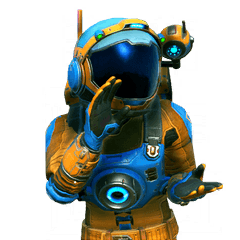
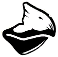
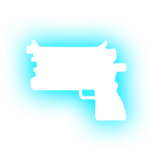
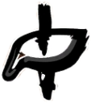

# No Man's Sky Social emojis

Here is a list of the currently available emojis on our Mastodon instance

| Name | Image | | Name | Image | | Name | Image | 
| :---: | :---: | :---: | :---: | :---: | :---: | :---: | :---: |
| :aclass: |  | | :assistantApps: |  | | :assistantNMS: |  | 
| :atlas: |  | | :ban: |  | | :bclass: |  | 
| :blob: |  | | :catJam: |  | | :cclass: |  | 
| :clap: |  | | :communityMission: |  | | :corruptedDrone: |  | 
| :gek: |  | | :gib: |  | | :korvax: |  | 
| :multitool: |  | | :nanites: |  | | :nipnip: |  | 
| :nipnipplant: |  | | :quicksilver: |  | | :sclass: |  | 
| :sentinel: |  | | :spacePhone: |  | | :thumbsUp: |  | 
| :units: |  | | :vc: |  | | :vykeen: |  | 
| :waveAnomaly: |  | | :wonder: |  | 
